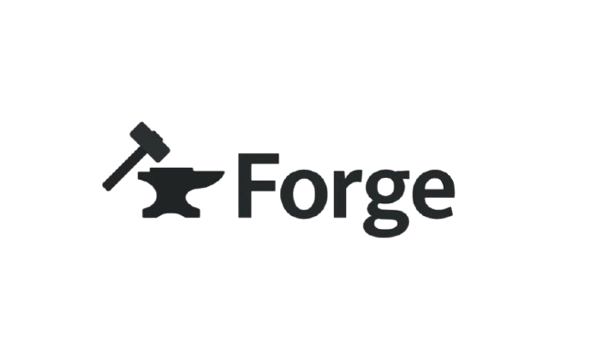

<div align="center">
  
</div>


## Overview

Forge is a **modern** and **user-friendly build system** written in **C++20**. It is designed to simplify and optimize the build process for projects of any size. With its powerful features and intuitive design, Forge is the perfect tool for developers looking for a flexible and efficient build system.

---

## Key Features

- **Decomposition of Build Configurations**:  
  Forge allows you to split build configurations into multiple reusable files, making it easier to manage complex projects.

- **Python-Like Imports**:  
  Supports Python-like imports, optimizing the parsing and processing phases of configurations.

- **HTML Build Results**:  
  Generates **HTML outputs** of the build results, making them easy to read and understand.

- **Caching**:  
  Implements caching mechanisms to avoid redundant builds, improving performance.

- **Parallel Processing**:  
  Supports parallel execution of tasks, significantly speeding up the build process.

- **Ease of Use**:  
  Designed to be simple and intuitive, making it easy to learn and use for developers of all skill levels.

- **Flexibility**:  
  A powerful and flexible system that can be adapted to any project.

---

## Why Choose Forge?

### 1. **Readable Build Outputs**
Forge generates visually appealing **HTML reports** for build results, making it easy to identify issues and understand the build process.

---

### 2. **Optimized for Speed**
With features like **caching** and **parallel processing**, Forge ensures that your builds are as fast and efficient as possible.

---

### 3. **Modern Design**
Built with **C++20**, Forge leverages the latest advancements in the language to provide a robust and modern build system.

---

## How It Works

1. **Define Your Build Configurations**:  
   Write your build configurations in a modular and reusable way.

2. **Run Forge**:  
   Use Forge to parse and process your configurations.

3. **View Results**:  
   Check the **HTML output** for a detailed summary of the build process.

---

## Directory Structure
```
├── assets
│   └── forge.png
├── docs
│   ├── html
│   └── latex
├── Doxyfile
├── examples
│   ├── example-1
│   │   ├── array_gen
│   │   ├── array.txt
│   │   ├── forgefile
│   │   ├── graph.png
│   │   ├── output2.html
│   │   ├── output3.html
│   │   ├── output.html
│   │   ├── sample.c
│   │   └── sample_dep.c
│   ├── example-2
│   │   ├── graph.png
│   │   ├── sample2.mk
│   │   ├── sample3.mk
│   │   └── sample.mk
│   └── example-3
│       └── Query-Optimiser
│           ├── call.py
│           ├── clean.forge
│           ├── DBMS Term Project.pdf
│           ├── deploy.py
│           ├── forgefile
│           ├── forge_output.html
│           ├── graph.png
│           ├── inp.txt
│           ├── lexer.forge
│           ├── Makefile
│           ├── output2.html
│           ├── output3.html
│           ├── output.txt
│           ├── README.md
│           ├── requirements.txt
│           ├── res.txt
│           ├── rev_graph.png
│           ├── test.l
│           ├── test_res
│           ├── test_target_translator.cxx
│           ├── test_translator.cxx
│           ├── test_translator.h
│           ├── test.y
│           ├── tmp
│           │   ├── in.txt
│           │   └── out.txt
│           └── translator.forge
├── Forge-Code-Documentation.pdf
├── README.md
└── src
    ├── argparse.hpp
    ├── cache.hpp
    ├── coderunner.hpp
    ├── configure
    ├── graph.hpp
    ├── main.cpp
    ├── Makefile
    ├── parser.cpp
    ├── parser.hpp
    └── tabulate.hpp

```


## Installation

### Prerequisites
- **C++20 Compiler** (e.g., GCC 10+, Clang 10+)
- **Python 3** (for certain features like HTML generation)
- **SQLite3** (for caching)
- **OpenSSL** (for hashing)

### Steps
1. Clone the repository:
   ```bash
   git clone https://github.com/Kronos-192081/Forge.git
   cd Forge/src
   ```
2. Install Pre-requisites:
    ```sh
    ./configure
    ```

3. Build Forge:
    ```sh
    make
    ```
4. Install Forge:
    ```sh
    sudo make install
    ```

### Examples
```bash
$ cd examples
$ cd example-1
$ forge # for single threaded build
$ forge -j <nproc> # for multithreaded build
```
For a more rigorous example, go to example-2:
```bash
$ cd example-2
$ forge # for single threaded build
$ forge -j <nproc> # for multithreaded build
```

## Contributing

We welcome contributions to Forge! To get started:

```
1. Fork the repository.
2. Create a new branch for your feature or bug fix.
3. Submit a pull request.
```

### Acknowledgments

Special thanks to p-ranav for the libraries argparse and tabulate which has streamlined the development of Forge.
